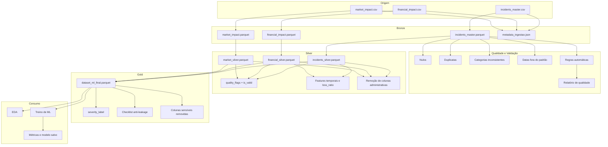

# Data Lineage

## Transformações principais

- Entrada: `incidents_master.csv`, `financial_impact.csv`, `market_impact.csv`
- Bronze: padronização de nomes para `snake_case`, conversão segura de booleanos, datas e timestamps quando possível, persistência em Parquet e registro de metadados com hash SHA-256
- Validação: análise de nulos, duplicatas, categorias inconsistentes, datas fora do padrão e regras automáticas de qualidade
- Silver: deduplicação por `incident_id`, geração de `quality_flags` e `is_valid`, criação de `incident_year`, `incident_month`, `incident_dow`, `days_to_discovery`, `days_to_disclosure` e `loss_ratio`, remoção de colunas administrativas
- Gold: merge das três tabelas, criação de `severity_label`, remoção de colunas com data leakage e salvamento do dataset final para ML
- Consumo: EDA, treino dos modelos, métricas e persistência do artefato final

## Artefatos Gerados

- `data/bronze/*.parquet`
- `data/bronze/metadata_ingestao.json`
- `data/silver/*.parquet`
- `data/gold/dataset_ml_final.parquet`
- `reports/data_quality_report.md`
- `reports/anti_leakage_checklist.md`
